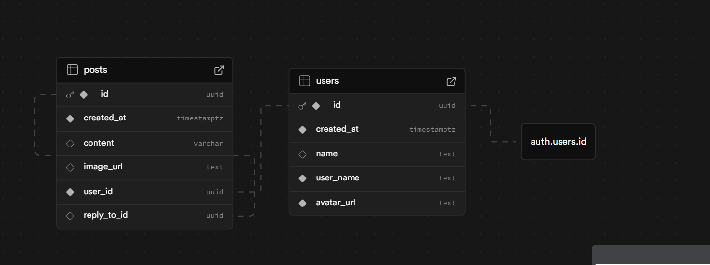

# 🐦 X-Clone

A lightweight Twitter-style clone built with **Next.js 16**, **TypeScript**, and **Supabase**.  
Users can authenticate with GitHub, create posts with text or optional images, and comment on other users' posts.

---

## 📘 Overview

This project implements a simplified social feed where:

- Users can **sign in/out** using **GitHub OAuth** via Supabase Auth.
- Authenticated users can **create posts** (text or images). (Images not supported yet!)
- Anyone (even unauthenticated users) can **view posts and comments**.
- Authenticated users can **reply** to posts (one-level comments).
- The UI is responsive and designed with **TailwindCSS**.
- Reusable components are used for both **posts and replies**.
- Performance boost with Server Components inside Client Components

---

## 🧱 Architecture

### Frontend

- **Next.js 16** (App Router)
- **TypeScript**
- **TailwindCSS 4**
- **React Server Components** + **Client Components**
  - Server components handle Supabase server calls for optimized performance.
  - Client components handle user interaction (post creation, comment toggling, etc.).

### Backend

- **Supabase** (PostgreSQL)
  - `auth.users`: managed by Supabase Auth.
  - `public.users`: stores public user info (name, username, avatar).
  - `public.posts`: stores posts and replies.

---

## 🗄️ Database Design

| Table            | Description                                                                              |
| ---------------- | ---------------------------------------------------------------------------------------- |
| **auth.users**   | Supabase-managed table for authentication (GitHub login).                                |
| **public.users** | Public user data cloned from `auth.users` via a trigger function.                        |
| **posts**        | Stores user posts and replies. Replies are limited to one level (no replies to replies). |

### Trigger Function

A PostgreSQL trigger automatically inserts a row in `public.users` after a new user is created in `auth.users`.

| Command             | Description                                     |
| ------------------- | ----------------------------------------------- |
| `npm run dev`       | Starts the dev server                           |
| `npm run build`     | Builds for production                           |
| `npm run start`     | Starts the production server                    |
| `npm run lint`      | Runs ESLint                                     |
| `npm run gen:types` | Generates TypeScript types from Supabase schema |
